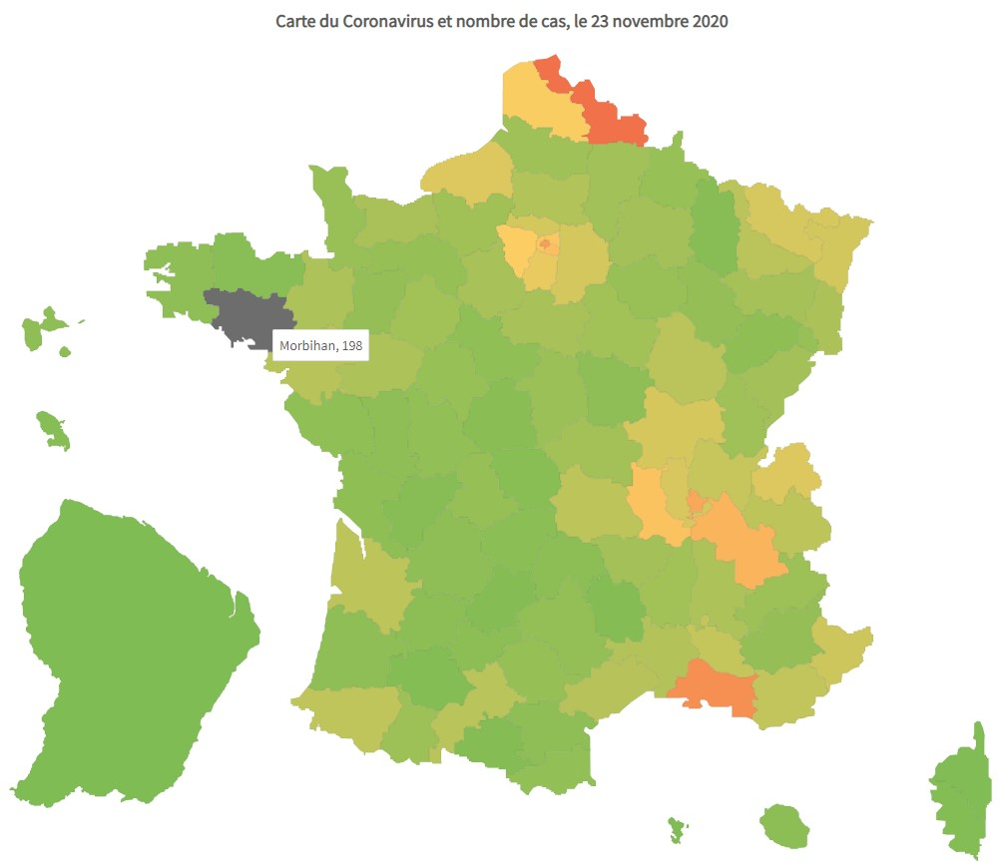

# Visualize COVID-19 cases in France

The heat map is a graphical representation of COVID-19 case data to give a
quick impression of the location of cases in every region of France.
The map is daily updated.

The datasets are retrieved from the [open platform for French public data](https://data.gouv.fr).



## Tech Stack

This project is a single-page application (SPA) with interactive map.

### Front-End:
- Angular 11
- Bootstrap 4.5
- FusionCharts map library
- Font Awesome icons

## Development

Start the Angular dev-server on `localhost:4200` in root directory:
```
./gradlew npm_start
```
